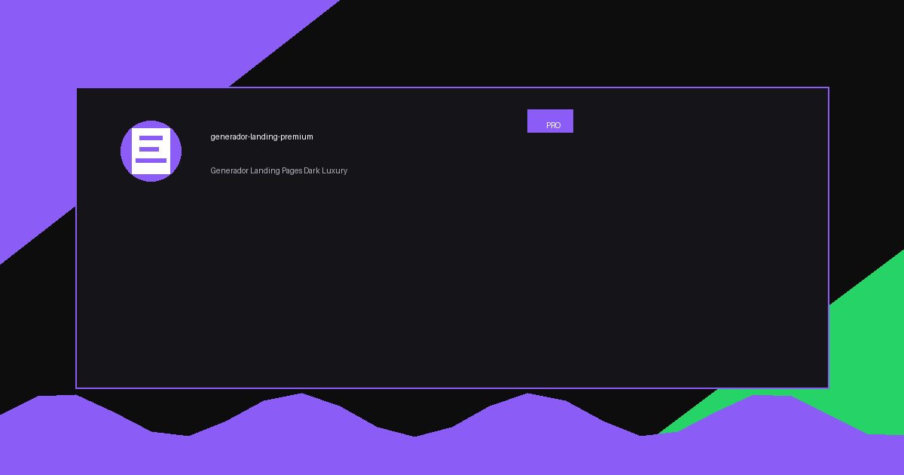

<p align="center">
  
</p>

<h1 align="center">🚀 Generador de Landing Pages Premium</h1>

<p align="center">
  <strong>Skill para Claude, Antigravity y NoCode que genera landing pages Dark Luxury completas en minutos — con glassmorphism, animaciones 3D, flip cards, partículas y código listo para publicar.</strong>
</p>

<p align="center">
  
  
  
  
  
</p>

<p align="center">
  <a href="#-acerca-del-proyecto">Acerca</a> •
  <a href="#-características">Características</a> •
  <a href="#-demo-de-output">Demo</a> •
  <a href="#-instalación">Instalación</a> •
  <a href="#-cómo-funciona">Cómo Funciona</a> •
  <a href="#-contacto">Contacto</a>
</p>

---

## 📖 Acerca del Proyecto

<p align="center">
  
</p>

**Generador de Landing Pages Premium** es un skill de IA que convierte 3 respuestas simples en una landing page de alto impacto visual. En lugar de pasar horas programando CSS o buscando plantillas, describes tu negocio y el agente genera:

- Todo el HTML, CSS y JS en un **único archivo listo para publicar**
- **Imágenes personalizadas** con IA (logo, hero visual, servicios)
- **Páginas legales** incluidas (Privacidad, Cookies, Términos)
- **Integración con n8n** para captura de leads sin backend

Inspirado en los mejores diseños de startups tech y agencias premium, con estética **Dark Luxury**: fondos negros, glassmorphism, partículas flotantes y efectos de glow.

### 🛠️ Construido Con

<p align="left">
  
  
  
  
  
  
</p>

---

## ✨ Características

| Característica | Descripción |
|---|---|
| 🎨 **Dark Luxury** | Fondos negros premium, glassmorphism y efectos de glow con color personalizable |
| 🃏 **Flip Cards 3D** | Tarjetas de servicios con animación flip 180° que revelan descripción al hover |
| ✨ **Partículas animadas** | Sistema de partículas flotantes generadas en JS, únicas para cada visita |
| 🖼️ **Imágenes con IA** | Logo, hero visual y 6 imágenes de servicios generadas automáticamente |
| 🔗 **Integración n8n** | Formulario conectado a webhook para automatización de leads |
| 🛡️ **Honeypot anti-bot** | Protección silenciosa contra spam sin CAPTCHA |
| ⚡ **Un solo archivo** | Todo el CSS y JS incrustado en `index.html`, sin dependencias locales |
| 📱 **100% Responsivo** | Mobile-first, con tap-to-flip en service cards para móvil |
| 📊 **Contadores animados** | Métricas que cuentan desde 0 al hacer scroll (IntersectionObserver) |
| 📜 **Legal incluido** | Genera `privacidad.html`, `cookies.html` y `terminos.html` automáticamente |

---

## 🎬 Demo de Output

<p align="center">
  
</p>

### Flujo completo en 3 pasos

```
1. Usuario responde 3 preguntas (negocio · sector · color)
        ↓
2. IA genera todas las imágenes (logo · hero · 6 servicios)
        ↓
3. IA produce index.html completo + /legal/*.html listos para subir
```

### Ejemplos de output por sector

<p align="center">
  
  &nbsp;
  
  &nbsp;
  
</p>

---

## 🚀 Instalación

### Opción A — Claude Code (CLI)

```sh
git clone https://github.com/oscaromargp/generador-landing-premium.git
cp generador-landing-premium/SKILL.md ~/.claude/skills/generador-landing-premium.md
```

El skill estará disponible en tu próxima sesión de Claude Code.

### Opción B — Antigravity

1. Descarga `SKILL.md` de este repositorio
2. Ve a tu proyecto → **Skills → Importar skill**
3. Selecciona el archivo `SKILL.md`
4. El skill aparece en tu biblioteca listo para usar

### Opción C — NoCode

1. Agrega un nodo de tipo **Agente Claude**
2. Pega el contenido de `SKILL.md` en el campo de instrucciones del nodo
3. Conéctalo al flujo: **Trigger → Agente (este skill) → Guardar HTML → Deploy**

---

## 💡 Cómo Funciona

### Las 3 preguntas iniciales

Invoca el skill con frases como:

```
"Crea una landing page para mi agencia de marketing"
"Hazme un sitio web para mi startup de IA"
"Necesito una página de ventas para mi consultoría"
"Genera una landing para mi portafolio freelance"
```

El skill te hará estas 3 preguntas antes de generar nada:

```
❓ 1. Nombre, tagline y propuesta de valor del negocio
❓ 2. Sector e industria (Tech, Creativa, Corporativa, etc.)
❓ 3. Color de acento principal (HEX o elige de la paleta)
```

### Estructura del output generado

```
mi-landing/
├── index.html              # Landing completa (HTML + CSS + JS incrustados)
├── images/
│   ├── logo.png            # Logo generado con IA
│   ├── hero_visual.png     # Visual 3D del hero
│   ├── service_1.png       # Imagen servicio 1
│   ├── service_2.png       # Imagen servicio 2
│   ├── service_3.png       # Imagen servicio 3
│   ├── service_4.png       # Imagen servicio 4
│   ├── service_5.png       # Imagen servicio 5
│   └── service_6.png       # Imagen servicio 6
└── legal/
    ├── privacidad.html     # Política de Privacidad
    ├── cookies.html        # Política de Cookies
    └── terminos.html       # Términos y Condiciones
```

### Colores de acento disponibles

<p align="center">
  
  
  
  
  
  
</p>

---

## 🏗️ Arquitectura del Skill

```
generador-landing-premium/
├── SKILL.md                      # El skill — instrucciones completas para el agente IA
├── README.md                     # Este archivo
├── LICENSE                       # MIT License
├── assets/
│   ├── banner.png                # Banner de este repositorio
│   └── IMAGES.md                 # Guía para crear imágenes del proyecto
└── samples/
    ├── landing-tech.html         # Ejemplo: Tech/SaaS con azul eléctrico
    ├── landing-creativa.html     # Ejemplo: Agencia creativa con púrpura
    └── landing-corporativa.html  # Ejemplo: Corporativa con naranja
```

---

## 🤝 Contribuyendo

¿Quieres agregar soporte para un nuevo sector, mejorar las animaciones o añadir integración con otra herramienta?

1. Haz un fork: `gh repo fork oscaromargp/generador-landing-premium`
2. Crea tu rama: `git checkout -b feature/nuevo-sector`
3. Commit: `git commit -m 'feat: agrega sector educación'`
4. Push: `git push origin feature/nuevo-sector`
5. Abre un Pull Request

---

## 💖 Apoya este Proyecto

Si este skill te ha ahorrado horas de trabajo o te ha ayudado a lanzar tu negocio, considera hacer una contribución.

<p align="center">
  <strong>Donaciones en Criptomonedas — Red XRP</strong><br/><br/>
  
</p>

> Dirección XRP: `rBthUCndKy3Xbb19Ln4xkZeMwusX9NrYfj`

---

## 📄 Licencia

Distribuido bajo la licencia MIT. Consulta el archivo [LICENSE](LICENSE) para más información.

---

## 📬 Contacto

<p align="center">
  <strong>Oscar Omar Gómez Peña</strong>
</p>

<p align="center">
  <a href="https://oscaromargp.github.io/Oscaromargp/">
    
  </a>
  &nbsp;
  <a href="https://github.com/oscaromargp">
    
  </a>
</p>

<p align="center">
  <a href="https://github.com/oscaromargp/generador-landing-premium">🔗 Ver este repositorio en GitHub</a>
</p>

---

## 🙏 Agradecimientos

<p align="center">
  <br/>
  <em>
    "Porque Dios es el que en vosotros produce<br/>
    así el querer como el hacer,<br/>
    por su buena voluntad."
  </em>
  <br/>
  <strong>— Filipenses 2:13</strong>
  <br/><br/>
  Todo lo que aquí existe nació primero como un deseo en el corazón.<br/>
  Cada proyecto, cada línea, cada idea que toma forma —<br/>
  es un regalo de Aquel que nos dio tanto el sueño como la fuerza de alcanzarlo.<br/>
  <strong>A Dios, toda la gloria.</strong>
  <br/>
</p>

---

- [awesome-readme](https://github.com/matiassingers/awesome-readme) — por la inspiración en documentación de calidad
- [Shields.io](https://shields.io) — por los badges dinámicos
- [Anthropic / Claude](https://anthropic.com) — por el motor de IA
- [n8n](https://n8n.io) — por la automatización de workflows
- [Google Fonts](https://fonts.google.com) — Plus Jakarta Sans & Inter


## 💬 Preguntas y Soporte

<p align="center">
  <a href="https://wa.me/526121077805?text=Hola%20Oscar%2C%20vi%20tu%20proyecto%20en%20GitHub%20y%20quisiera%20preguntarte...">
    
  </a>
</p>

